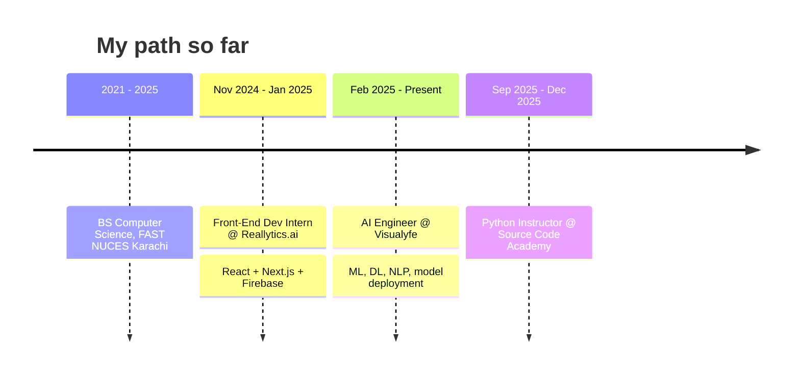
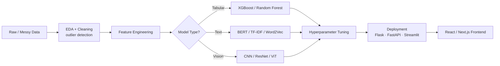

# Hey, I'm Waqar Ahmed 👋
### AI Engineer @ Visualyfe · ML / NLP / Deep Learning · Full-Stack (React · Next.js)

Computer Science grad turning messy real-world data into models that actually ship —
and building the interfaces people use to reach them.

---

## 🧭 Where I am right now

---

## 🧠 How I build ML/AI systems

Every project below is a real pass through this pipeline — not a tutorial dataset.

---

## 🚀 Featured Projects

### 🚕 Uber Fare Prediction
**Problem:** Raw ride data is noisy — corrupted GPS points, missing fares, no obvious signal.
**What I did:**
- Cleaned **190k+ real Uber trips**, removing under 5% of records using IQR + percentile outlier detection
- Implemented the **Haversine formula from scratch** to compute trip distance from raw GPS — it became the single most important feature at **90% model importance**
- Engineered temporal features (rush hour, night, weekend flags) to capture NYC pricing patterns
- Compared Linear Regression, Random Forest, and Gradient Boosting

**Result:** Gradient Boosting won with **R² of 0.83** and **RMSE of $3.50** — then shipped as a live interactive Streamlit app.

`Python` `Scikit-learn` `Pandas` `NumPy` `Streamlit`

---

### 🩺 GraphMedX
**Problem:** Clinical notes are unstructured — relationships between symptoms, diagnoses, and treatments stay buried in free text.
**What I did:**
- Built an **NLP pipeline** to extract medical entities from unstructured clinical text
- Linked extracted entities into a **knowledge graph** using NetworkX
- Surfaced non-obvious relationships between symptoms, diagnoses, and treatments via graph algorithms

`Python` `NLTK` `NetworkX` `OpenAI API` `PyTesseract`

---

## 🛠️ Tech Stack

**Languages**

**ML / AI**

**Web**

**Tools**

---

## 📈 GitHub Stats

---

## 🎓 Education & Certifications

**BS Computer Science** — FAST National University of Computer and Emerging Sciences, Karachi (2021–2025)

- IBM Data Analyst
- Google Advanced Python Programming
- Prodigy InfoTech — Machine Learning Internship
- Visualyfe — Internship Completion + Recommendation Letter

---

**Currently exploring:** agentic RAG systems, LangChain-based pipelines, and making deployed models survive contact with real users.

📫 **waqarahmedme7@gmail.com**

