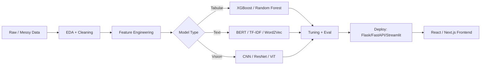

<div align="center">


[](https://github.com/YOUR_GITHUB_USERNAME)
[](https://linkedin.com/in/YOUR_LINKEDIN)
[](mailto:waqarahmedme7@gmail.com)

</div>

<br>

<table width="100%">
<tr><td>

🔴 🟡 🟢 &nbsp; **~/about — zsh**

```
$ whoami
> Waqar Ahmed — AI Engineer @ Visualyfe, Karachi PK

$ cat mission.txt
> Turning messy, real-world data into models that ship —
> then wiring them into interfaces people actually use.

$ cat education.txt
> BS Computer Science — FAST NUCES, Karachi (2021 – 2025)
```

</td></tr>
</table>

<br>

<table width="100%">
<tr><td>

🔴 🟡 🟢 &nbsp; **~/experience — history**

```
Feb 2025 - Present    AI Engineer @ Visualyfe
                       ML · Deep Learning · NLP · model deployment

Sep 2025 - Dec 2025    Python Instructor @ Source Code Academy
                       Taught Python, DSA & OOP to 50+ students

Nov 2024 - Jan 2025    Front-End Dev Intern @ Reallytics.ai
                       React · Next.js · Firebase · Agile sprints
```

</td></tr>
</table>

<br>

<table width="100%">
<tr><td>

🔴 🟡 🟢 &nbsp; **~/pipeline — how I build AI systems**



</td></tr>
</table>

<br>

<table width="100%">
<tr><td width="50%" valign="top">

🔴 🟡 🟢 &nbsp; **~/projects/uber-fare — README**

```
$ cat summary.md

Cleaned 190k+ real Uber trips using
IQR + percentile outlier detection
(<5% records removed).

Implemented Haversine formula from
scratch for trip distance — became
the #1 feature at 90% importance.

Compared Linear Regression, Random
Forest, Gradient Boosting.

> Result: R² = 0.83, RMSE = $3.50
> Shipped as a live Streamlit app.
```

`Python` `Scikit-learn` `Pandas` `Streamlit`

[](#)
[](#)

</td><td width="50%" valign="top">

🔴 🟡 🟢 &nbsp; **~/projects/graphmedx — README**

```
$ cat summary.md

Built an NLP pipeline extracting
medical entities from unstructured
clinical text.

Linked entities into a knowledge
graph using NetworkX.

Surfaced non-obvious relationships
between symptoms, diagnoses and
treatments via graph algorithms.

> Stack: NLTK, OpenAI API, PyTesseract
```

`Python` `NLTK` `NetworkX` `OpenAI API`

[](#)

</td></tr>
</table>

<br>

<table width="100%">
<tr><td>

🔴 🟡 🟢 &nbsp; **~/skills — ls -la**

<div align="center">


<br>


<br>


<br>


</div>

</td></tr>
</table>

<br>

<table width="100%">
<tr><td>

🔴 🟡 🟢 &nbsp; **~/stats — top**

<div align="center">


</div>

</td></tr>
</table>

<br>

<table width="100%">
<tr><td>

🔴 🟡 🟢 &nbsp; **~/contact — mail**

```
$ cat contact.txt
> Email     waqarahmedme7@gmail.com
> GitHub    github.com/YOUR_GITHUB_USERNAME
> LinkedIn  linkedin.com/in/YOUR_LINKEDIN

$ echo $STATUS
> Open to AI Engineer / ML roles
```

</td></tr>
</table>

<div align="center">
<br>


</div>
